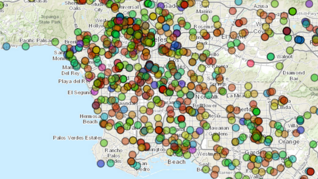

Los Angeles Linguistic Geography
=============



For [Hack For LA 2014](http://www.hackforla.org/), my project was [Los Angeles Linguistic Geography]( http://losangeleslinguisticgeography.herokuapp.com/). I won the third prize from Esri for use of their mapping technology.

Los Angeles Linguistic Geography is an experiment in visualizing real-time linguistic data. The focus of this project is to explore the possiblities of real-time local visualization of information and communication within a city. 

Data on tweets in languages other than English are visualized based on their location. As the tweets occur in real-time, they are displayed and pop up on the map.  Each color on the map represents a different language, according to Twitter's data.

Map data is sourced from Esri, using the [Esri Leaflet plugin](https://github.com/Esri/esri-leaflet).

Linguistic data is sourced from Twitter, and is embedded within Tweets that are accessed via the Twitter API. The server subscribes to all tweets within the bounding box of Los Angeles, and filters to only store/display Tweets that either are tagged as in a language other than English, or whose users are configured as having a native language other than English.

It turns out that Twitter is quite bad at detecting language, to great humerous effect during my presentation. Steps are taken to filter out false positives:

* Twitter is better at identifying languages in other character sets, so whitelist those
* If the user and tweet language are the same, it's likely good
* Otherwise, require a high number of tokens, with the assumption that confidence can increase with more text

Next steps would be to begin to do analytics on the data, to give more up-to-date information on language use in the community on this particular social network.

[The project page on Suprmasv](https://www.suprmasv.com/projects/208/los-angeles-linguistic-geography).


## Deployment Notes

```shell
heroku create losangeleslinguisticgeography
heroku config:add BUILDPACK_URL=https://github.com/heroku/heroku-buildpack-nodejs
heroku labs:enable websockets
heroku addons:add mongolab

heroku config:set TWITTER_CONSUMER_KEY_LAHACK="XXXX"
heroku config:set TWITTER_CONSUMER_SECRET_LAHACK="XXXX"
heroku config:set TWITTER_ACCESS_TOKEN_LAHACK="XXXX"
heroku config:set TWITTER_ACCESS_TOKEN_SECRET_LAHACK="XXXX"
```

For Boston fork:

```shell

heroku config:set TWITTER_CONSUMER_KEY_LAHACK="XXXX" --remote boston
... etc
```

Self, don't forget before you try pushing to do:

    heroku accounts:set personal


